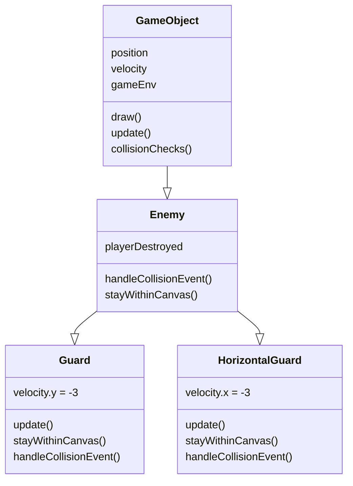

## Table of Contents
- [Writing Classes](#writing-classes)
- [Inheritance (Basic)](#inheritance-basic)
- [Constructor Chaining with super()](#constructor-chaining-with-super)
- [Method Overriding](#method-overriding)
- [Methods and Parameters](#methods-and-parameters)
- [Instantiation and Objects](#instantiation-and-objects)

## Writing Classes

Object-Oriented Programming begins with creating custom classes. A class is a blueprint for creating objects that share common properties and behaviors. Below is a basic class definition for a custom character:

```javascript
class Character {
    constructor(name, health, position) {
        this.name = name;
        this.health = health;
        this.position = position;
    }

    draw() {
        // Logic to render character on screen
    }
}
```

Classes are the foundation of OOP. They allow us to organize code logically and reuse functionality across our applications.

## Inheritance (Basic)

Inheritance allows us to create a hierarchy of classes where child classes inherit properties and methods from parent classes. This promotes code reuse and logical organization.

In my game projects, I created custom enemy classes that extend the base `Enemy` class:

```javascript
import Enemy from '@assets/js/GameEnginev1/essentials/Enemy.js';
import Player from '@assets/js/GameEnginev1/essentials/Player.js';

// Guard inherits from Enemy
class Guard extends Enemy {
    constructor(data = null, gameEnv = null) {
        super(data, gameEnv);
        this.velocity.y = -3; // Vertical patrolling behavior
    }
}

// HorizontalGuard also inherits from Enemy
class HorizontalGuard extends Enemy {
    constructor(data = null, gameEnv = null) {
        super(data, gameEnv);
        this.velocity.x = -3; // Horizontal patrolling behavior
    }
}
```

Both `Guard` and `HorizontalGuard` extend the `Enemy` class, inheriting its properties and methods while adding their own specialized behavior. This is a 2-level class hierarchy: `GameObject` → `Enemy` → `Guard`.

### Class Hierarchy Diagram



**Reading the Diagram:**
- **Attributes (top portion):** Data stored in each object
  - `position`, `velocity`, `gameEnv` are inherited by all child classes
- **Methods (bottom portion):** Functions that each class can perform
  - Methods with the same name in child classes are *overridden* to create specialized behavior

## Constructor Chaining with super()

When a child class extends a parent class, the child's constructor must call `super()` to invoke the parent's constructor. This initializes inherited properties and ensures proper class hierarchy setup.

In the examples above, both `Guard` and `HorizontalGuard` use `super(data, gameEnv)` to initialize the parent `Enemy` class before setting their own velocity properties:

```javascript
class Guard extends Enemy {
    constructor(data = null, gameEnv = null) {
        super(data, gameEnv);  // Call parent constructor
        this.velocity.y = -3;  // Set child-specific property
    }
}
```

This pattern ensures that all inherited properties are properly initialized before the child class adds its own customizations.

## Method Overriding

Method overriding allows child classes to replace or extend the functionality of parent class methods. This is a key feature of polymorphism in OOP.

In my game projects, I overrode the `update()` and `stayWithinCanvas()` methods from the `Enemy` class to implement unique patrolling behavior:

### Example: Guard Class with Method Overriding

```javascript
import Enemy from '@assets/js/GameEnginev1/essentials/Enemy.js';
import Player from '@assets/js/GameEnginev1/essentials/Player.js';

class Guard extends Enemy {
    constructor(data = null, gameEnv = null) {
        super(data, gameEnv);
        this.velocity.y = -3 // Set an initial vertical velocity for the guard in the constructor. Because it is in the constructor, this velocity will be set as soon as the level starts.
    }

    /**
     * OVERRIDDEN METHOD: update()
     * The parent Enemy class has an update() method, but Guard provides its own implementation.
     * This override adds vertical patrol behavior to the guard.
     */
    update() {
        // Update begins by drawing the object
        this.draw();

        if (this.spriteData && typeof this.spriteData.update === 'function') {
            this.spriteData.update.call(this);
        }
        // Check for collision with the player
        if (!this.playerDestroyed && this.collisionChecks()) {
            this.handleCollisionEvent();
        }

        this.position.y += this.velocity.y; // update position

        // Ensure the object stays within the canvas boundaries
        this.stayWithinCanvas();
    }

    /**
     * OVERRIDDEN METHOD: stayWithinCanvas()
     * The parent Enemy class has this method, but Guard overrides it to add bouncing behavior
     * when the guard hits the top or bottom canvas boundaries.
     */
    stayWithinCanvas() {
        // Bottom of the canvas
        if (this.position.y + this.height > this.gameEnv.innerHeight) {
            this.position.y = this.gameEnv.innerHeight - this.height;
            this.velocity.y *= -1; // Reverse vertical velocity to create a "bounce" effect
            console.log(this.velocity.y);
        }
        // Top of the canvas
        if (this.position.y < 0) {
            this.position.y = 1;
            this.velocity.y *= -1; // Reverse vertical velocity to create a "bounce" effects
            console.log(this.velocity.y);
        }
        // Right of the canvas
        if (this.position.x + this.width > this.gameEnv.innerWidth) {
            this.position.x = this.gameEnv.innerWidth - this.width;
            this.velocity.x = 0;
        }
        // Left of the canvas
        if (this.position.x < 0) {
            this.position.x = 0;
            this.velocity.x = 0;
        }
    }

    /**
     * OVERRIDDEN METHOD: handleCollisionEvent()
     * Custom collision handling specific to the Guard class.
     */
    handleCollisionEvent() {
        var player = this.gameEnv.gameObjects.find(obj => obj instanceof Player); 

        console.log("Collision has occurred, player has been destroyed.");

        player.destroy();
        this.playerDestroyed = true;
    }
}

export default Guard;
```


Vertical patrolling enemy with Guard.js



import GameControl from '@assets/js/GameEnginev1.1/essentials/GameControl.js';
import GameLevelPatrollingGuard from '@assets/js/projects/collisions-mechanic/levels/GameLevelPatrollingGuard.js';
export const gameLevelClasses = [GameLevelPatrollingGuard];
export { GameControl };




### Example: HorizontalGuard Class with Method Overriding

```javascript
import Enemy from '@assets/js/GameEnginev1/essentials/Enemy.js';
import Player from '@assets/js/GameEnginev1/essentials/Player.js';

class HorizontalGuard extends Enemy {
    constructor(data = null, gameEnv = null) {
        super(data, gameEnv);
        this.velocity.x = -3 // Set an initial horizontal velocity for the guard in the constructor. Because it is in the constructor, this velocity will be set as soon as the level starts.
    }

    /**
     * OVERRIDDEN METHOD: update()
     * Similar to Guard, but implements horizontal patrol behavior instead of vertical.
     */
    update() {
        // Update begins by drawing the object
        this.draw();

        if (this.spriteData && typeof this.spriteData.update === 'function') {
            this.spriteData.update.call(this);
        }
        // Check for collision with the player
        if (!this.playerDestroyed && this.collisionChecks()) {
            this.handleCollisionEvent();
        }

        this.position.x += this.velocity.x; // update position

        // Ensure the object stays within the canvas boundaries
        this.stayWithinCanvas();
    }

    /**
     * OVERRIDDEN METHOD: stayWithinCanvas()
     * This override bounces horizontally instead of vertically.
     */
    stayWithinCanvas() {
        // Bottom of the canvas
        if (this.position.y + this.height > this.gameEnv.innerHeight) {
            this.position.y = this.gameEnv.innerHeight - this.height;
            this.velocity.y = 0
        }
        // Top of the canvas
        if (this.position.y < 0) {
            this.position.y = 0;
            this.velocity.y = 0;
        }
        // Right of the canvas
        if (this.position.x + this.width > this.gameEnv.innerWidth) {
            this.position.x = this.gameEnv.innerWidth - this.width;
            this.velocity.x *= -1; // Reverse horizontal velocity to create a "bounce" effect
            console.log(this.velocity.x);
        }
        // Left of the canvas
        if (this.position.x < 0) {
            this.position.x = 0;
            this.velocity.x *= -1; // Reverse horizontal velocity to create a "bounce" effect
            console.log(this.velocity.x);
        }
    }

    handleCollisionEvent() {
        var player = this.gameEnv.gameObjects.find(obj => obj instanceof Player); 

        console.log("Collision has occurred, player has been destroyed.");

        player.destroy();
        this.playerDestroyed = true;
    }
}

export default HorizontalGuard;
```


Horizontal patrolling enemy with HorizontalGuard.js



import GameControl from '@assets/js/GameEnginev1.1/essentials/GameControl.js';
import GameLevelHorizontalPatrollingGuard from '@assets/js/projects/collisions-mechanic/levels/GameLevelHorizontalPatrollingGuard.js';
export const gameLevelClasses = [GameLevelHorizontalPatrollingGuard];
export { GameControl };




## Methods and Parameters

Methods are functions defined within a class that perform actions on the object's data. Methods often accept **parameters** (inputs) that allow the method to behave differently based on the data passed to it.

### Methods with Multiple Parameters

One of the key benefits of OOP is the ability to create methods with multiple parameters that work with different types of data. Below is an example of a method with 2 parameters:

 
// Define the class
class Player {
  constructor(name, health) {
    this.name = name;
    this.health = health;
  }
  
  // Method with 2 parameters: damage amount and damage type
  takeDamage(damage, damageType) {
    this.health -= damage;
    console.log(`${this.name} took ${damage} ${damageType} damage! Health: ${this.health}`);
  }
}

// Create an object of the class
const hero = new Player("Soren", 100);

// Run the method on the object with different parameter values
hero.takeDamage(25, "lightning");  // 25 lightning damage
hero.takeDamage(15, "fire");       // 15 fire damage
 


### Real-World Game Example: collisionHandler()

In game development, methods with multiple parameters are essential. For example, a collision handler might take parameters for the colliding object and the direction of collision:

```javascript
/**
 * Handle collision with another object
 * @param {GameObject} other - The object we collided with
 * @param {String} direction - The direction of collision (e.g., "top", "bottom", "left", "right")
 */
collisionHandler(other, direction) {
    if (other instanceof Enemy) {
        console.log(`Collision from ${direction}!`);
        this.takeDamage(10);
    }
}
```

This method receives two parameters and uses both to determine how the collision should be handled.

## Instantiation and Objects

**Instantiation** is the process of creating an object from a class. When we instantiate an object, we create a specific instance with its own properties and methods based on the class definition.

### Object Instantiation in Game Levels

In my game projects, I instantiate game objects when configuring a level. Each level is initialized with multiple objects (background, player, enemies, etc.) by creating instances of their respective classes:

```javascript
// Example from a game level configuration
this.classes = [      
    { class: GameEnvBackground, data: bgData },
    { class: Player, data: playerData },
    { class: Guard, data: guardData },
    { class: HorizontalGuard, data: horizontalGuardData }
];
```

Each entry in this array creates a new **instance** of that class with the provided `data`. The game engine iterates through these classes and instantiates each object, populating the level with all necessary game objects.

### How Instantiation Works

When we write `new Guard(data, gameEnv)`, we are:
1. Creating a new instance of the `Guard` class
2. Calling the constructor with `data` and `gameEnv` as arguments
3. Initializing all properties defined in the constructor
4. The new `Guard` object inherits all methods from the parent `Enemy` class

This pattern of defining data in a configuration object and then instantiating multiple objects is used consistently across all game projects in this portfolio.
